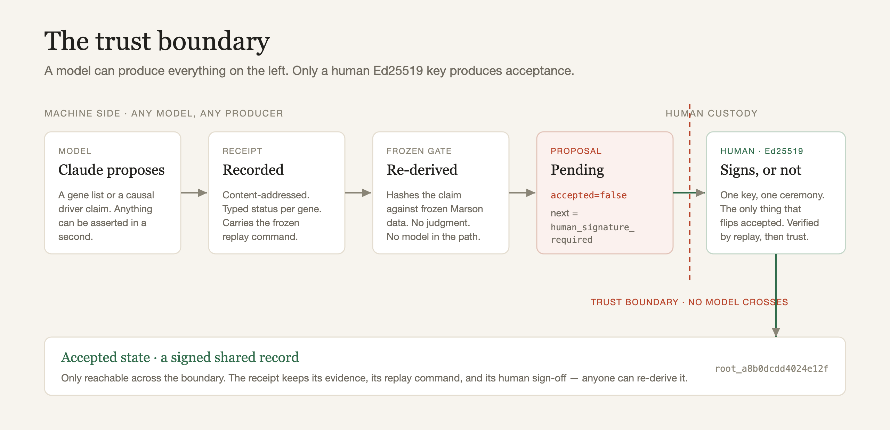
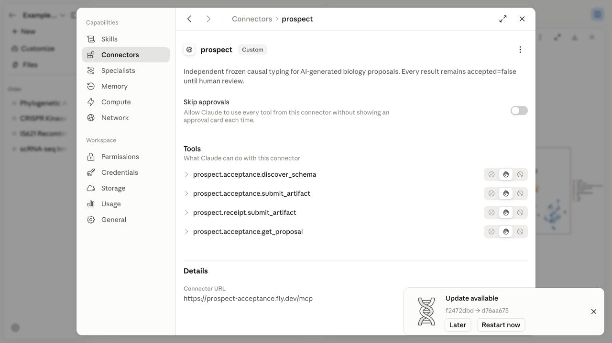

# Prospect

The tool that tells a biologist which genes in an AI prediction list behave as causal drivers.

Live: [prospect-sepia-six.vercel.app](https://prospect-sepia-six.vercel.app)

Demo script: [docs/DEMO.md](docs/DEMO.md). Judge handout: [docs/JUDGE_HANDOUT.md](docs/JUDGE_HANDOUT.md).
Devpost writeup: [docs/DEVPOST.md](docs/DEVPOST.md). Silent walkthrough: [docs/assets/prospect_demo.mp4](docs/assets/prospect_demo.mp4).



Every AI biology tool can produce a signature, gene list, or differential-expression table. Prospect
checks that activity against frozen perturbation data and returns typed verdicts: `evidence_attached`
for causal-driver evidence, `associative_only` for passengers, `contradicted` for refuted driver
claims, and `not_assayed` for genes the table cannot test. Reproducible is not verified. Every
submission stays `accepted=false` until a frozen replay and a human key accept the record.

The payload is primary human CD4+ T-cell activation. Prospect replays claims against the released
Marson CRISPRi Perturb-seq screen, a frozen CD4+ evidence graph with 11,526 genes, 37,106 regulatory
edges, five CD4+ findings, and root `root_a8b0dcdd4024e12f`. No model is in the trust path.

## What A Judge Sees

1. A real Claude Science scRNA-seq immunotherapy signature enters Prospect.
2. In the authenticated run, Claude Science preserves the artifact and its reviewer reports no issues.
3. Prospect asks the causal question: which signature genes move the activation program when perturbed?
4. Because the export is associative, the result is 12 `evidence_attached`, 25 `associative_only`,
   0 `contradicted`, and 15 `not_assayed`.
5. A judge can switch to an explicit causal claim. Only a comparable refuted driver claim can earn
   `contradicted`.
6. A pasted input receives the same receipt and verdicts through Python, HTTP, stdio MCP, or hosted MCP.

The live Claude Science call returned `proposal_f07c2c5c7578bbdb` and
`rcpt_f844b7e8206d9a8d`. Prospect consulted six frozen substrates, returned
`accepted=false`, and required a human signature. The complete content-addressed capture is
`examples/data/claude_science_connector_run.json`.

Prospect frames the signature as associative and separates drivers from passengers, which is exactly
what an associative signature needs before it can become a biological claim.



The hosted Streamable HTTP connector is registered in Claude Science with per-call approval enabled.
It exposes schema discovery, artifact submission, compatibility submission, and proposal retrieval.
Every submission remains `accepted=false` until human review.

## The Sharp Evidence

- **AI overclaiming:** 48% of confident major-regulator claims are contradicted by the measured data,
  rising to 64% on famous checkpoints and cytokines.
- **Real Claude Science artifact:** 52 genes typed as 12 drivers, 25 passengers, 0 contradicted
  driver claims, and 15 not assayed. Its reviewer reported no issues, while Prospect independently
  retained the result as a proposal.
- **PGGT1B:** one mechanism-first hypothesis worth testing, not accepted biology. The kept claim is a
  narrow CD4 activation-transcriptome hypothesis with prenylation partners, ChEMBL context, and a
  falsifiable primary CD4+ CRISPRi experiment.
- **MED12 correction:** an independently frozen GSE278572 comparison qualifies Prospect's own
  interpretation. High resting reach is evidence against activation specificity, but is not enough
  to call a gene housekeeping or an essentiality artifact.
- **Independent primary-CD4 calibration:** across 79 shared perturbations, Marson Stim48hr reach
  correlates with published day-eight activated-CD4 knockout reach (`rho=0.373895`, one-sided
  10,000-permutation `P=0.00039996`). All three pre-registered adversarial kills pass. Different
  activation times make this cross-context evidence, not condition-level equivalence. A committed
  sensitivity controls for Marson Rest reach and study batch: partial `rho=0.045808`, permutation
  `P=0.35246475`, and four of five kills fail. Broad reach replicates, but incremental
  activation-specific reach does not clear the locked bar.
- **Signed evidence graph:** five deterministic CD4+ findings recover known activation biology,
  separate effectors from drivers, distinguish Rest reach from activation specificity, compare
  covered K562 and RPE1 contexts, and recover CollecTRI regulons.
- **Receipt bridge:** any external workbench can submit a receipt through the MCP bridge. The bridge
  returns a proposal with `accepted=false`; an accepted record requires a human key.

## Public Artifacts

- `/data/check.json`
- `/data/frontier.json`
- `/data/claude_science_acceptance_demo.json`
- `/data/gse278572_comparator.json`
- `/data/gse271788_calibration.json`
- `/data/gse271788_activation_specificity.json`
- `/data/pggt1b_defended_evidence.json`
- `/data/finding_index.json`
- `/data/overclaim_counter.json`
- `/data/receipt_bridge/receipt_contract.json`
- `/data/receipt_bridge/receipt_manifest.json`
- `/data/receipt_bridge/receipt_bundle.json`

## Run It

```bash
# Offline: bare `git clone` + `pip install -r requirements.txt`. No API key, no network, no hosted service.
./prospect verify
python benchmark/mutation_pack.py
python tests/test_skill_parity.py
python tests/test_marson.py
python -m pytest tests/ -q
cd web && npm run typecheck && npm run build
./prospect demo-mode --reset
./prospect claude-science
./prospect substrate-coverage
./prospect pggt1b-defended-evidence
python frontier/gse271788_calibration.py --check
python frontier/gse271788_activation_specificity.py --check
python examples/claude_science_connector_client.py --json   # real 52-gene split over the stdio MCP
python examples/receipt_bridge_client.py --json
python receipt/replay_proposal.py <local-proposal.json>

# Needs a local acceptance service: start it first, then point the connectors at it.
./prospect serve-acceptance --port 8130 --data-dir var/acceptance_service
python examples/claude_science_connector_client.py --url http://127.0.0.1:8130/mcp --json
python examples/prospect_connector_client.py --case openresearch --url http://127.0.0.1:8130/mcp --json

# Hosted (already live): the paste box + the hosted MCP at prospect-acceptance.fly.dev run the same frozen gate.
python receipt/replay_proposal.py <hosted-proposal-url>

# Verify the signature; do not re-sign. root_a8b0dcdd4024e12f is committed; a fresh clone mints
# its own local key, so a signing command would produce a different root. Re-derive and compare instead.
```

## Guarantees

- Frozen released data, never a live differential-expression recompute.
- Typed status only, no wet-lab or clinical truth claim.
- Content-addressed replay: `./prospect verify` re-derives 53k objects with zero drift.
- Human Ed25519 signature over accepted records. No model makes the final call.
- Mutation pack floor: zero tampered claim is admitted.
- MCP bridge and acceptance service submit proposals only.
- `prospect.receipt.v1` binds the complete proposal body. Acceptance is a separate event.

## Data

- Marson CD4+ T-cell CRISPRi Perturb-seq, Zhu, Dann, Marson 2025.
- Replogle genome-scale Perturb-seq, K562 and RPE1, Replogle et al. Cell 2022, PMID 35688146.
- CollecTRI regulons and frozen public context used only as evidence, never as automatic acceptance.
- Weinstock/Freimer GSE171737 and GSE271788 primary human CD4+ knockout reach, reduced from the
  authors' published LFSR tables under a committed pre-registration.

## License

MIT. Built during Built with Claude: Life Sciences, Jul 7 to 13, 2026. See [NEW_WORK.md](NEW_WORK.md).
