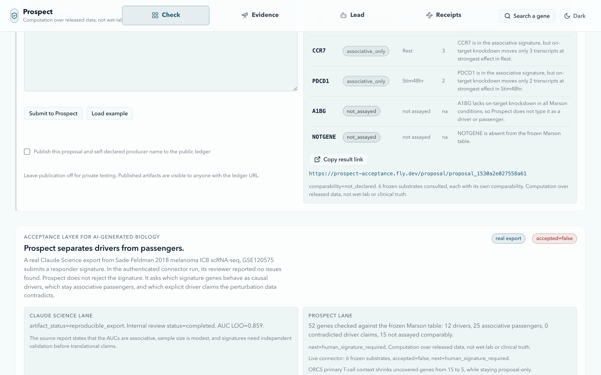
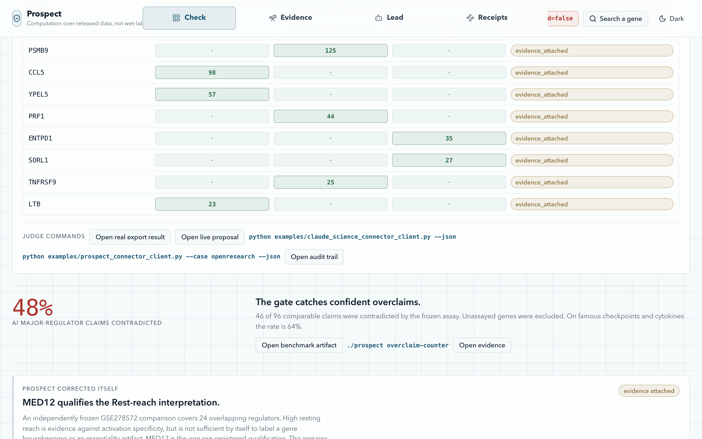

# Prospect

**The acceptance layer for AI-generated biology.**

Live: [prospect-sepia-six.vercel.app](https://prospect-sepia-six.vercel.app) ·
Repo: [github.com/williamjblair/prospect](https://github.com/williamjblair/prospect) ·
Signed root: `root_a8b0dcdd4024e12f`

> Reproducible is not verified. Prospect checks an AI-generated gene list against frozen
> perturbation data, separates candidate drivers from passengers, and keeps every result
> `accepted=false` until a human key signs.


A 53-second captioned walkthrough is at [`docs/assets/prospect_demo.mp4`](assets/prospect_demo.mp4).


## Inspiration

A model can produce a plausible list of disease genes in a second. Claude Science and tools like it
can go further: preserve the artifact, its code, its environment, and a review trail, so the work is
reproducible. But reproducible is not the same as verified. A signature that an internal reviewer
found no issues with can still be associative rather than causal, and a confident "major regulator"
claim can be flatly contradicted by the measured data.

We wanted a layer that sits after generation and before belief. It should take whatever a model
produces, check it against released perturbation data that no model can move, and refuse to call
anything accepted until a human signs for it.

## What it does

Paste a gene list, a differential-expression table, ranked markers, or a signature. Prospect returns
a typed split for each gene:

- **evidence_attached**: behaves like a candidate driver in the frozen assay.
- **associative_only**: in the signature, but the perturbation data does not support a driver role.
- **contradicted**: an explicit causal claim the measured data rejects.
- **not_assayed**: absent from the frozen table, so Prospect declines to type it.

Every result carries a content-addressed receipt, a replay command, and the same verdict:
`accepted=false`, `next=human_signature_required`.



We ran a real Claude Science export through it: a Sade-Feldman 2018 melanoma ICB scRNA-seq responder
signature (GSE120575). Claude Science preserved the artifact and its reviewer reported no issues.
Prospect did not reject the signature. It asked the causal question the session leaves open and
returned 52 genes typed as 12 candidate drivers, 25 associative passengers, 0 contradicted driver
claims, and 15 not assayed, still `accepted=false`.

## How we used Claude

Claude is on the generative side of the boundary, and never on the trust side.

- **A Claude Science connector.** Prospect registers a hosted Streamable HTTP MCP connector inside
  Claude Science with proposal-only tools. A Claude Science session can send its real export straight
  into Prospect's frozen gate and get back a receipt and a persistent proposal page. The connector
  cannot accept anything; it can only propose.
- **A Claude agent loop.** A Claude agent proposes gene lists, searches the literature for prior art,
  and drafts mechanism hypotheses. Each output lands as a proposal with `accepted=false`. The model
  does the proposing, searching, and drafting; a frozen gate and a human key do the accepting.

This is the deliberate design: the model is maximally useful where it generates, and structurally
excluded where the record becomes true. Across the whole system, the count of accepted records a
model has mutated is zero.


## How we built it

- **A frozen causal gate** over the released Marson primary human CD4+ CRISPRi Perturb-seq screen.
  The gate is plain code over frozen released data. It never recomputes differential expression live
  and never asks a model for a verdict.
- **A content-addressed evidence graph**: 11,526 genes and 37,106 regulatory edges, with five signed
  CD4+ findings under root `root_a8b0dcdd4024e12f`. `./prospect verify` re-derives all 53,485 objects
  from frozen data with zero drift.
- **Ed25519 signing** as the only path to an accepted record. A fresh clone auto-generates its own
  local key, so the committed root can be verified by re-derivation but never silently re-signed.
- **A static, reproducible narrative.** The entire on-site judge story is served from committed JSON.
  The core science reproduces from a bare `git clone` plus `pip install -r requirements.txt`: no API
  key, no cloud storage, no large data download. CI runs the same path.

## The number that made the case

We built an overclaiming benchmark from confident AI major-regulator claims. Of 96 claims comparable
to the frozen assay, 46 were contradicted by the measured data. That is 48 percent, and it rises to
64 percent on the famous checkpoints and cytokines that show up most in generated lists.



Prospect also corrects itself. An independently frozen GSE278572 comparison qualifies Prospect's own
MED12 interpretation: high resting reach argues against activation specificity, but does not by
itself establish housekeeping or essentiality. The qualification is pre-registered and the record
stays `accepted=false`. A trust layer that cannot flag its own overreach is not a trust layer.

## Accomplishments

- A real Claude Science artifact submitted through an in-product connector and gated, end to end.
- A measured, reproducible overclaiming rate on AI biology claims rather than an anecdote.
- One honest, proposal-only lead: PGGT1B, presented with its prenylation mechanism, its partners, a
  refutation experiment, and an open batch-specificity question rather than as settled biology.
- A frozen gate that re-derives with zero drift and a signing boundary with zero model mutations.

## Challenges

Keeping the model out of the trust path while still using it heavily took discipline. Every
generative feature had to end at a proposal. The honest downgrade of an activation-specificity claim
was uncomfortable to ship, and it is the strongest evidence that the gate is real.

## What's next

Open the connector to outside producers, add more frozen substrates beyond the Marson screen, and
close the first genuinely independent producer loop so an outside team's claim moves through the gate
without us in the middle.

## Try it out

A 36-second silent walkthrough is at [`docs/assets/prospect_demo.mp4`](assets/prospect_demo.mp4).
The one-page judge handout is [`docs/JUDGE_HANDOUT.md`](JUDGE_HANDOUT.md); the two-minute demo script
is [`docs/DEMO.md`](DEMO.md).

Everything below runs offline from a bare `git clone` plus `pip install -r requirements.txt`:

```bash
./prospect verify                                    # re-derive 53,485 objects, 0 drift
python examples/claude_science_connector_client.py --json   # the real 52-gene split, stdio MCP
python benchmark/mutation_pack.py                    # frozen benchmark, 0 false admissions
```

Ceiling: Prospect proves computation over released data, not wet-lab or clinical truth.

## Built with

Python, Next.js, TypeScript, the Model Context Protocol, Claude Science, Ed25519 signing, Vercel, and
Fly.io. Data: the Marson primary human CD4+ Perturb-seq screen and public GEO/SRA perturbation
studies.
