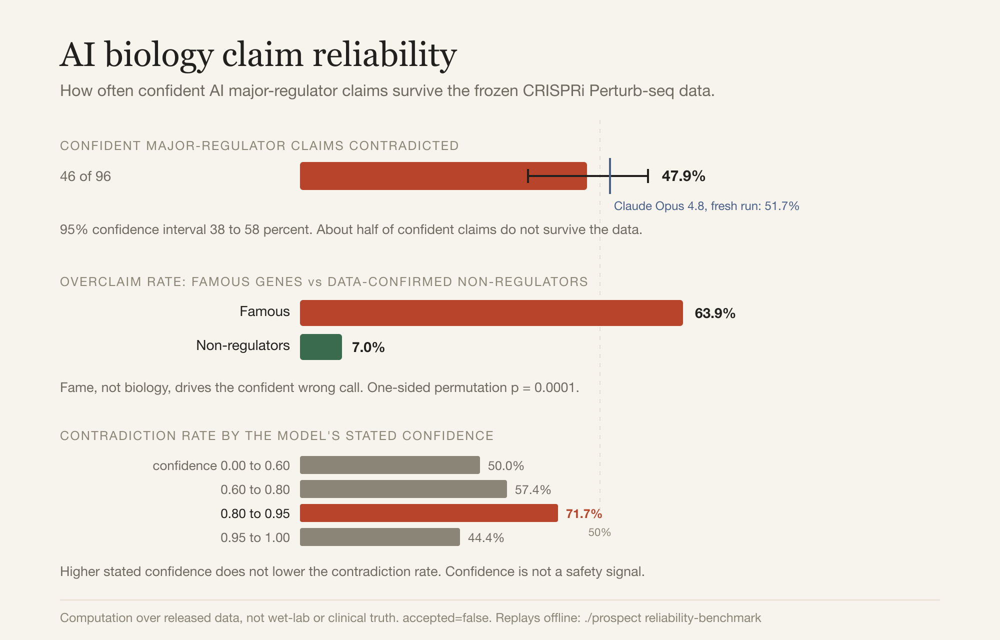

# The AI Biology Claim Reliability Benchmark

How often do confident LLM biology claims survive contact with frozen experimental ground truth, and
does a model's stated confidence track whether the data contradicts it?

Prospect answers this by measurement, not opinion. It asks a model, blind to the answer, to judge
genes as major regulators of the CD4+ T-cell activation transcriptome, then checks every confident
claim against a frozen CRISPRi Perturb-seq differential-expression table with a deterministic,
model-free checker. The result carries confidence intervals, a significance test, and a
confidence-calibration curve, and the whole pipeline replays offline from committed data.

```bash
./prospect reliability-benchmark      # reproduce every number below, no API key, no re-grading
```



## Method

- **Ground truth:** the released Marson primary human CD4+ CRISPRi Perturb-seq DE table
  (`examples/data/marson_de_full.csv`, 11,526 genes, committed and SHA-pinned). Never recomputed.
- **Checker:** `engine/checkers/marson_perturbseq.py`, a deterministic dict lookup. A confident
  "major regulator" claim is contradicted (`refuted`) when on-target knockdown is confirmed but no
  condition (Rest, Stim8hr, Stim48hr) shows more than 10 differentially expressed genes.
- **Corpus:** `examples/data/benchmark_corpus.json`, frozen at seed 7: 220 core genes (55 per truth
  class) plus 18 famous checkpoint and cytokine genes reported separately.
- **Models:** the four-model pooled result covers Haiku 4.5, Sonnet 5, Opus 4.8, and Fable 5. A fresh
  Claude Opus 4.8 pass was run for the current-model line.
- **Statistics (pure standard library):** Wilson 95% score intervals on every rate; a seeded
  10,000-iteration permutation test for the famous-gene effect. The model generations (claim text and
  stated confidence) are frozen in the committed `bench_*.jsonl`, so re-running makes no API call.

## Two metrics, kept separate

The headline is often stated as one number; it is two, with different denominators.

1. **Contradiction rate.** Of confident major-regulator claims the assay could check (on-target
   knockdown confirmed), the fraction the measured data contradicts.
2. **Overclaim frequency on famous genes.** Of judgments on the 18 famous checkpoint and cytokine
   genes the data shows are not major regulators, the fraction a model confidently called major.

## Results

**Confident AI major-regulator claims are contradicted about half the time.**

| Population | Contradicted / checkable | Rate | 95% CI |
|---|---|---|---|
| Pooled (Haiku, Sonnet, Opus, Fable) | 46 / 96 | 47.9% | 38.2% to 57.8% |
| Haiku 4.5 | 14 / 25 | 56.0% | 37.1% to 73.3% |
| Sonnet 5 | 11 / 27 | 40.7% | 24.5% to 59.3% |
| Opus 4.8 | 12 / 25 | 48.0% | 30.0% to 66.5% |
| Fable 5 | 9 / 19 | 47.4% | 27.3% to 68.3% |
| Opus 4.8, fresh run | 15 / 29 | 51.7% | 34.4% to 68.6% |

The per-model intervals overlap: this corpus does not have the power to rank the models, and a fresh
Claude Opus 4.8 run is no more reliable on this task than the pooled set. The honest claim is about
the population of confident claims, not about which model is best.

**Models overclaim famous genes far more than random non-regulators.** On the 18 famous
checkpoint and cytokine genes, models call the gene a major regulator 63.9% of the time
(95% CI 52.3% to 74.0%). On genes the frozen data classes as non-regulators, the same models do so
only 7.0% of the time. The difference is 56.9 percentage points, one-sided permutation p = 0.0001
(10,000 iterations, seed 7, n_famous = 72, n_baseline = 215). Fame, not biology, drives the claim.

**Stated confidence does not track correctness.** Binning confident claims by the model's own stated
confidence, the contradiction rate does not fall as confidence rises:

| Stated confidence | Contradicted / n | Rate |
|---|---|---|
| 0.00 to 0.60 | 4 / 8 | 50.0% |
| 0.60 to 0.80 | 39 / 68 | 57.4% |
| 0.80 to 0.95 | 33 / 46 | 71.7% |
| 0.95 to 1.00 | 4 / 9 | 44.4% |

The highest contradiction rate sits in the 0.80 to 0.95 band. A model that expresses more confidence
here is not more likely to be right.

## Why this matters

Reproducible is not verified. A model can produce a fluent, confident regulatory claim in a second,
and roughly half of those claims do not survive the frozen data, while famous genes draw a wrong,
confident call nine times out of ten. This is the empirical case for an acceptance layer that checks a
claim against frozen ground truth before it becomes shared state, and never lets stated confidence
stand in for evidence.

## Limitations

- One lab's released CD4+ Perturb-seq screen defines "major regulator" operationally (more than 10 DE
  genes under a tested condition). A different assay or threshold would move the absolute rates.
- Denominators are modest (96 checkable core claims pooled; 19 to 29 per model), so per-model
  comparisons are underpowered; the intervals say so.
- The 18 famous genes are a deliberately enriched set, reported separately and never folded into the
  headline contradiction rate.
- Ceiling: computation over released data, not wet-lab or clinical truth. The benchmark packet stays
  `accepted: false`, `next: human_signature_required`.

## Reproduce

```bash
# Offline, from committed frozen runs (no API key, no re-grading):
./prospect reliability-benchmark
python -m pytest tests/test_reliability_benchmark.py -q

# Regenerate a model's frozen run (needs an Anthropic key in .env; costs a few cents to a few dollars):
python loop/run.py --model claude-opus-4-8 --corpus examples/data/benchmark_corpus.json --tag opus_current
```

The full packet, with every rate, interval, the permutation test, the calibration table, and the
input hashes, is `examples/data/reliability_benchmark.json`.
